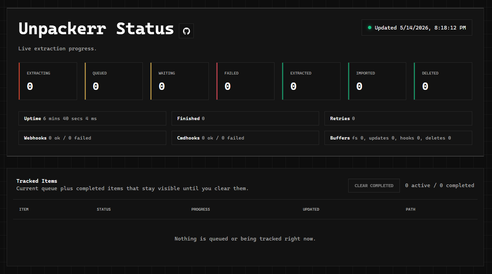

> [!IMPORTANT]
> This fork is maintained for personal use only and is not an official Unpackerr release.

> [!NOTE]
> UnpackUI primarily adds a lightweight UI for monitoring extraction status, while keeping Unpackerr's core behavior intact aside from a few targeted fixes and quality-of-life improvements.
>
> Native Discord webhooks can edit one message per extract (`update_existing = true`) with richer embeds and an optional **Open UI** button when `web_url` is set. Notifiarr remains fully supported.




## About

Unpackerr runs as a daemon on your download host or seedbox.
It checks for completed downloads and extracts them so
[Lidarr](http://lidarr.audio), [Radarr](http://radarr.video),
[Readarr](http://readarr.com), and [Sonarr](http://sonarr.tv) may import them. 
If your problem is rar files getting stuck in your activity queue, then this is your solution.

Not a starr app user, and just need to extract files? We do that too.
This application can run standalone and extract files found in a "watch" folder.
In other words, you can configure this application to watch your download folder, and
it will happily extract everything you download. 

Interested? Check out the website with installation instructions:

### [https://unpackerr.zip](https://unpackerr.zip)

**Website missing what you need? We can [chat on Discord](https://golift.io/discord) too.**

## What's it extract?

The absolute basics, just ask STaRDoGG. It also extracts recursively, meaning deep within folders, and archives within archives.
**Tars, Rars, Zips, 7-Zips, Gzips, Tarred gzips and bzips; encrypted rars and 7zips. And ISO disc images.**
Need something else? Ask. Does it do too much? Let me know what knobs you need. [Open a request!](https://github.com/Unpackerr/unpackerr/issues/new)

## Attribution

The following fine folks are providing their services, completely free! These service
integrations are used for things like storage, building, compiling, distribution and
documentation support. This project succeeds because of them. Thank you!

[](https://packagecloud.io)
[](https://GitHub.com)
[](https://cloud.docker.com)
[](https://golift.io)
[](https://cloudflare.com)

## Contributing

Yes, please. Just make a pull request and lets chat about it in the PR or on Discord.

## Local Testing

For quick local testing on Windows with the local UI config:

```powershell
& 'C:\Program Files\Go\bin\go.exe' build -o unpackerr.exe .
.\unpackerr.exe -c .\unpackerr.local.conf
```

## License

[MIT](https://unpackerr.zip/docs/unpackerr/license)
